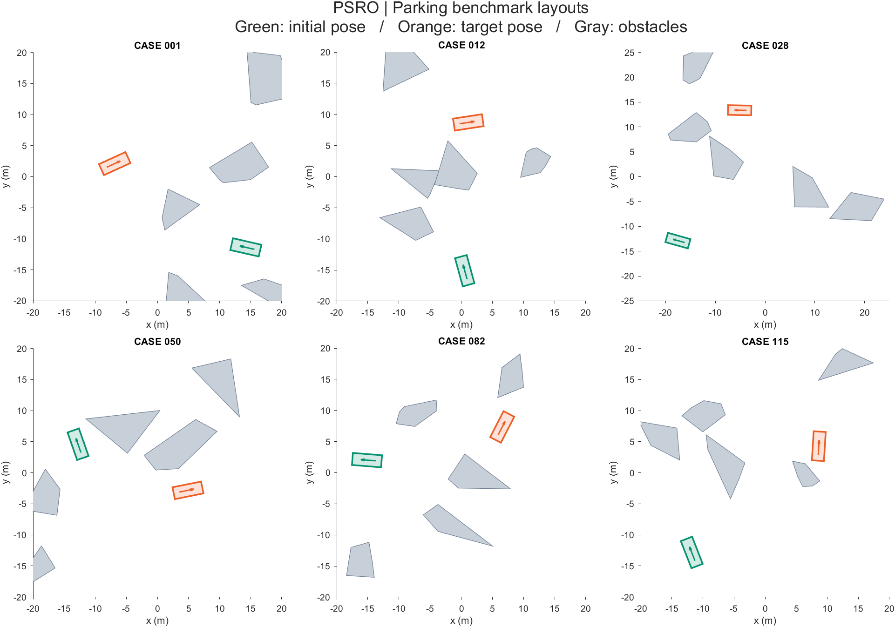

# PSRO: Parking Trajectory Optimization with Half-Space Constraints

**Search for a feasible route, construct a simpler collision-avoidance problem, and optimize the parking maneuver.** This MATLAB/AMPL repository accompanies **Chapter 3** of the Chinese-language book **《非结构化场景自动驾驶轨迹规划技术》** (*Trajectory Planning Techniques for Autonomous Driving in Unstructured Environments*, English rendering of the Chinese title).

The source paper is **“基于半空间约束理论的自动泊车高性能轨迹优化方法” / “High-performance Trajectory Optimization for Automated Parking via Half-space Constraining Theory”**, published in *Journal of Mechanical Engineering* in 2024. Please cite the paper below when using the method or code.



*Input scenes from the 115-case collection. Green outlines and arrows show initial poses; orange shows target poses; gray polygons are obstacles. These are benchmark layouts, not computed optimal trajectories.*

## Planning architecture

The planner starts with a Hybrid A* reference path. The PSRO stage uses reference geometry to construct half-space collision constraints and a local admissible region, then solves a discretized optimal-control problem. Preselecting the relevant constraints reduces the burden of general polygon collision avoidance on the nonlinear optimizer.


`NLP_PSRO.mod` minimizes **maneuver time** `tf`. It describes position, heading, speed, acceleration, steering angle and steering rate, together with vehicle-corner coordinates. The constraints cover discrete bicycle kinematics, endpoint conditions, physical limits, collision half-spaces and bounds around a reference iterate. Read the chapter and paper for the construction of the predefined space; the model file exposes the constraints submitted to the solver.

## Requirements

- **MATLAB on Windows**: the original loader and solver scripts use Windows paths and shell commands.
- **Image Processing Toolbox** for `strel` and `imdilate` in cost-map construction.
- A working **AMPL + IPOPT** installation. The original Windows executables and supporting libraries are included; AMPL still needs a valid license for the model size. Keep the solver files together.
- The supplied **MATLAB P-code** components, compatible with your MATLAB release. They are executable files, not missing sources.

The checked-in `ipopt.opt` selects **MA57**; this must be supported by the installed IPOPT build and linear-solver libraries. MATLAB and AMPL exchange files, so no MATLAB–AMPL API connector is needed.

## Run one case or the full collection

Set MATLAB's current folder to this repository and unpack the cases once:

```matlab
cd('C:/path/to/predefined-space-rapid-optimization');
unzip('ParkingBenchmarks.zip', pwd);
```

Check that `ParkingBenchmarks/CaseNo_1.mat` exists. For one experiment:

```matlab
clear; clc; close all;
global params_
Initial();
params_.user.case_id = 1;       % Integer from 1 to 115
InitializeParams();
SearchViaHAs();
OptiViaPSRO();
```

Alternatively, run `RunMe`. **The original `RunMe.m` loops over all 115 cases.** To select a single case in that script, change `for ii = 1:115` to, for example, `for ii = 1`. A `case_id` assigned before the unmodified script is overwritten by its loop.

Run from a writable repository folder. Preserve `NLPFolder/` and `NLPResults/`: they are solver exchange directories. `r_PSRO.run` loads generated inputs, invokes IPOPT, records the current solve status and writes the optimized profiles into `NLPResults/`. Check the current status flag before interpreting result files.

## File and function guide

| File | Role |
| --- | --- |
| `RunMe.m` | Full benchmark driver: initialization, case loop, Hybrid A* and PSRO. |
| `Initial.m` | Allocate per-case success, cost and infeasibility records. |
| `InitializeParams.m` | Load a case, define vehicle/search/optimization parameters, and construct cost maps. `LoadCase` and `CreateCostmaps` are local functions. |
| `SearchViaHAs.p` | Protected Hybrid A* reference-path generator. |
| `SearchViaAStar.m` | Two-dimensional grid-search helper for path-length/search support. |
| `ResamplePath.p` | Protected path resampling. |
| `OptiViaPSRO.p` | Protected PSRO optimization driver. |
| `WriteInNLP.p` | Write the optimization inputs consumed by AMPL. |
| `NLP_PSRO.mod` | Inspectable nonlinear optimal-control model. |
| `r_PSRO.run` | AMPL batch script: load inputs, solve and export status/profiles. |
| `MeasureInfeasibility_.m` | Sum of squared discrete kinematic defects. |
| `DrawDemo.m` | Draw obstacles and endpoint headings; it does not solve a trajectory. |
| `Arrow.p`, `asd_opti.p` | Protected plotting helpers, retained under their original names. |
| `ParkingBenchmarks.zip` | 115 input cases with endpoint poses and obstacle polygons. |
| `NLPFolder/`, `NLPResults/` | Input/output exchange between MATLAB and AMPL. |

## Checked-in settings

| Quantity | Value |
| --- | --- |
| Wheelbase / front overhang / rear overhang | 2.8 / 0.96 / 0.929 m |
| Vehicle width | 1.942 m |
| Speed / acceleration bounds | 2.5 m/s / 1.0 m/s² |
| Steering-angle / steering-rate bounds | 0.75 rad / 0.5 rad/s |
| Optimization configurations | 100 |
| Hybrid A* spatial / angular resolution | 0.4 m / 0.2 rad |
| Hybrid A* iteration limit | 500 |
| Nominal workspace | −20 to 20 m per axis; cases 22 and 28 use −25 to 25 m |

These are the values in `InitializeParams.m`; the README does not replace them with settings from other chapters. Update the geometry, model inputs and task together when extending the example.

## Citation

> 陈晓明, 李柏, 范丽丽, 王涯舟, 张坦探, 张友民, 曹东璞. 基于半空间约束理论的自动泊车高性能轨迹优化方法. **机械工程学报**, 2024, **60**(10): 273–288. [DOI: 10.3901/JME.2024.10.273](https://doi.org/10.3901/JME.2024.10.273).

English bibliographic form:

> Xiaoming Chen, Bai Li, Lili Fan, Yazhou Wang, Tantan Zhang, Youmin Zhang, and Dongpu Cao, “High-performance Trajectory Optimization for Automated Parking via Half-space Constraining Theory,” *Journal of Mechanical Engineering*, vol. 60, no. 10, pp. 273–288, 2024. **Article in Chinese.**

```bibtex
@article{Chen2024PSRO,
  author = {Chen, Xiaoming and Li, Bai and Fan, Lili and Wang, Yazhou
            and Zhang, Tantan and Zhang, Youmin and Cao, Dongpu},
  title = {High-performance Trajectory Optimization for Automated Parking
           via Half-space Constraining Theory},
  journal = {Journal of Mechanical Engineering},
  volume = {60}, number = {10}, pages = {273--288}, year = {2024},
  doi = {10.3901/JME.2024.10.273},
  note = {In Chinese}
}
```

See the [publisher's article page](https://qikan.cmes.org/jxgcxb/EN/10.3901/JME.2024.10.273) for publication details and the full paper for the derivation and experimental analysis.
